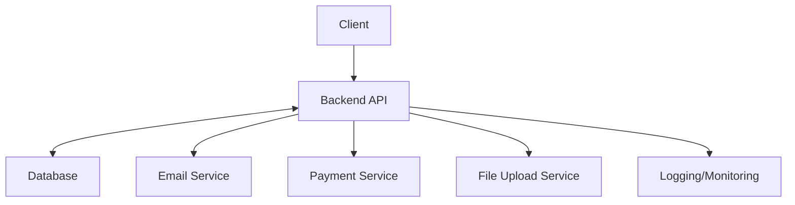

# System Architecture

## Overview

The Loumo App is designed as a modular, scalable system using a service-oriented architecture. It consists of a backend API, a database, and supporting services for email, payments, and file uploads.

## Main Components

- **Backend API**: Node.js/Express server handling business logic, authentication, and API endpoints.
- **Database**: Relational database managed via Prisma ORM (see `prisma/schema.prisma`).
- **Email Service**: Handles transactional emails (welcome, password reset, notifications).
- **Payment Service**: Integrates with payment gateways to process transactions and check payment statuses.
- **File Upload Service**: Manages image and file uploads for products and shops.
- **Logging & Monitoring**: Captures errors, warnings, and system logs for diagnostics.

## Component Interactions

- The **Backend API** communicates with the **Database** for CRUD operations.
- **Email Service** is triggered by user actions (registration, order updates).
- **Payment Service** is called during checkout and order processing.
- **File Upload Service** is used when users upload product/shop images.
- **Logging** is integrated throughout the backend for error and activity tracking.

## Deployment

- Services are containerized using Docker and orchestrated via `docker-compose`.
- Environment variables and configuration files manage secrets and settings.
- The system is designed for deployment on cloud platforms or on-premises servers.

## Diagram (Textual)

- [Client] → [Backend API] ↔ [Database]
- [Backend API] → [Email Service]
- [Backend API] → [Payment Service]
- [Backend API] → [File Upload Service]
- [Backend API] → [Logging/Monitoring]

---

_For more details, see `deployment.md` and `docker-compose.yml`._
