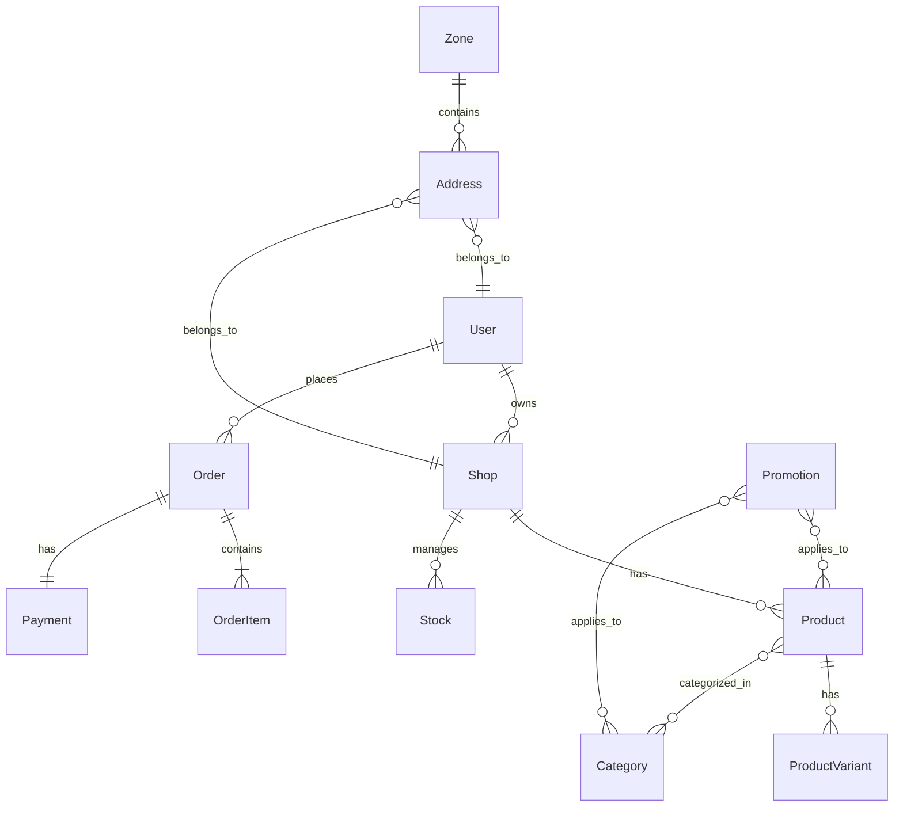

# Database Analysis

## Overview

This document provides an analysis of the database structure for the Loumo App. It covers the main entities, their relationships, and the rationale behind the design.

## Key Entities

- **User**: Stores user information such as name, email, password, and roles.
- **Shop**: Represents shops managed by users or agents.
- **Product**: Contains product details, categories, and variants.
- **Order**: Tracks customer orders, including order items and payment status.
- **Category**: Organizes products into logical groups.
- **Promotion**: Manages discounts and promotional campaigns.
- **Stock**: Tracks inventory levels for products and variants.
- **Payment**: Records payment transactions and statuses.
- **Address**: Stores shipping and billing addresses for users and shops.
- **Zone**: Defines delivery or operational zones.

## Relationships

- A **User** can own or manage multiple **Shops**.
- A **Shop** can have multiple **Products** and **Categories**.
- **Products** can have multiple **Variants** (e.g., size, color).
- **Orders** are linked to **Users**, **Shops**, and contain multiple **Order Items**.
- **Promotions** can apply to **Products** or **Categories**.
- **Stock** is managed per **Product Variant** and **Shop**.
- **Payments** are associated with **Orders**.
- **Addresses** are linked to **Users** and **Shops**.
- **Zones** are used for delivery and logistics.

## ER Diagram (Textual)

- User (1) --- (M) Shop
- Shop (1) --- (M) Product
- Product (1) --- (M) ProductVariant
- Order (1) --- (M) OrderItem
- User (1) --- (M) Order
- Order (1) --- (1) Payment
- Product (M) --- (M) Category
- Promotion (M) --- (M) Product/Category
- Shop (1) --- (M) Stock
- Address (M) --- (1) User/Shop
- Zone (1) --- (M) Address

## Notes

- The schema is designed for scalability and flexibility, supporting multiple shops, users, and product variations.
- Referential integrity is enforced via foreign keys.
- Indexes are used on frequently queried fields for performance.

---

_For detailed schema, see `prisma/schema.prisma`._
